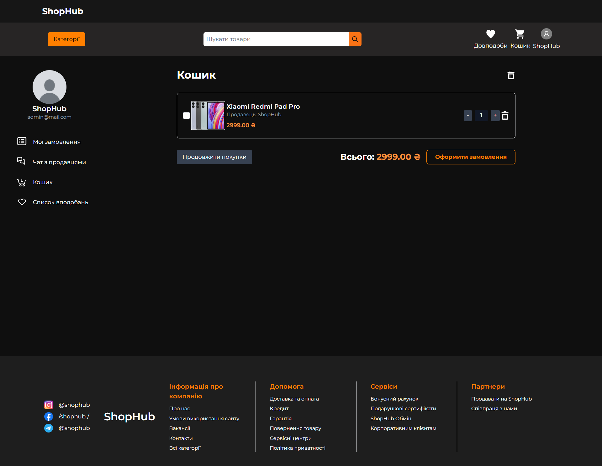
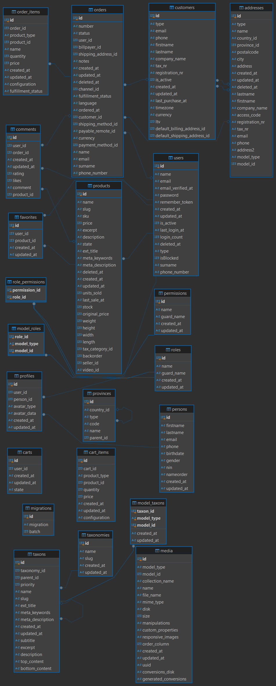

# ShopHub

A modern multi-vendor e-commerce platform inspired by Rozetka, built with Laravel, React, Inertia.js, and Tailwind CSS.

---

## ✨ Features

- 🛒 Multi-vendor marketplace
- 👤 Customer & Seller accounts
- 📦 Product management
- ❤️ Favorites & product reviews
- 📋 Order tracking
- 📊 Seller analytics
- 🛠️ Admin dashboard
- 💬 Comment moderation
- 🔐 Email verification

---

## 🏗️ Tech Stack

### Backend
- Laravel
- PHP
- Vanilo

### Frontend
- React
- Inertia.js
- Tailwind CSS

### Database
- MySQL

### Tools
- Git
- GitHub

---

## 📸 Screenshots

### Home Page


### Product Page


### Shopping Cart



### Admin Dashboard


---

## 🗄️ Database Schema



---

## 🚀 Project Status

✅ Completed

This project was developed as a university team project and is no longer under active development.

---

## ⚙️ Installation

### 1. Clone the repository

```bash
git clone https://github.com/regularuser548/store-app.git
cd store-app
```

### 2. Install dependencies

```bash
composer install
npm install
```

### 3. Configure the environment

Create the environment file and generate the application key:

```bash
cp .env.example .env
php artisan key:generate
```

Then:

- Create a MySQL database (or use SQLite).
- Update the database credentials in `.env`.
- Set:

```env
APP_URL=http://localhost:8000
```

when running locally.

### 4. Set up the database

```bash
php artisan migrate --seed
```

### 5. Create the storage symlink

```bash
php artisan storage:link
```

### 6. Start the application

Backend:

```bash
php artisan serve
```

Frontend:

```bash
npm run dev
```

Open:

```
http://127.0.0.1:8000
```

---

## 👤 Default Administrator Account

```
Email:    admin@mail.com
Password: admin
```

> ⚠️ Change the administrator password before deploying to production.

---

## 📝 Notes

- Products are **not seeded** by default.
- Log in as an administrator and create products before using the storefront.

---

## 👥 Team

### Development

- Tymofii Shyshkovskyi
- Oleksii Tsymbryla
- Vladyslav Smyrnov

### Design

- Tymofii Chudashkin
- Maksym Hrenchuk

---

## 📄 License

This project was created for educational purposes.
